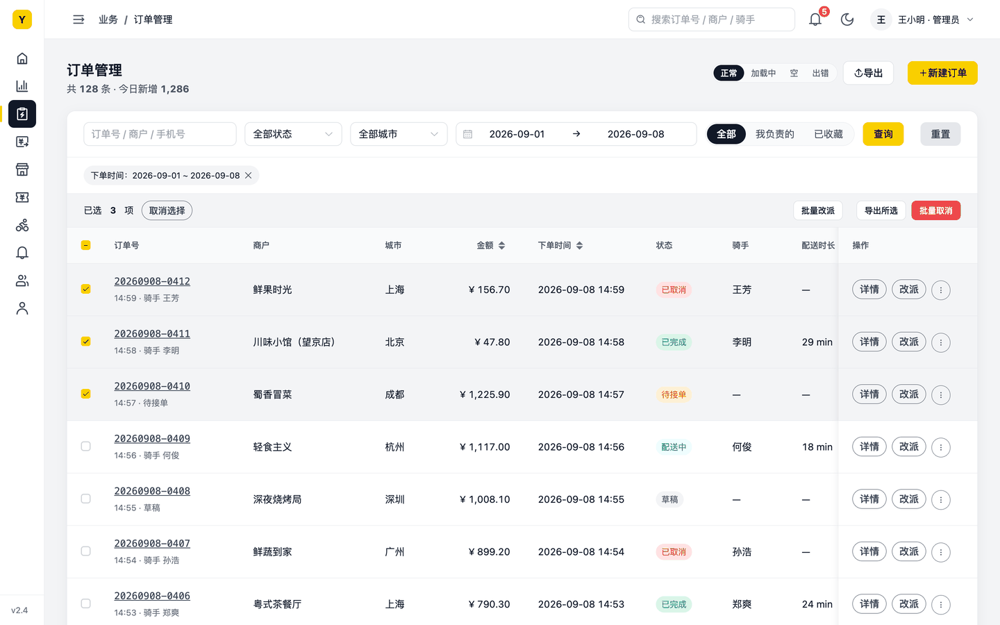
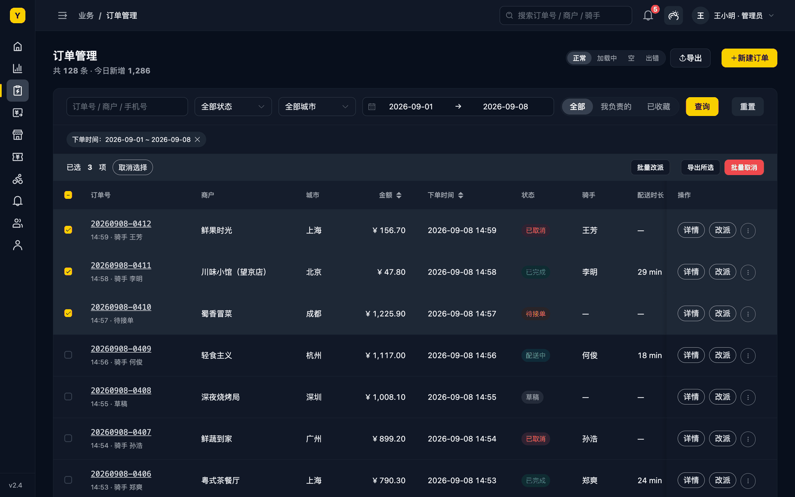
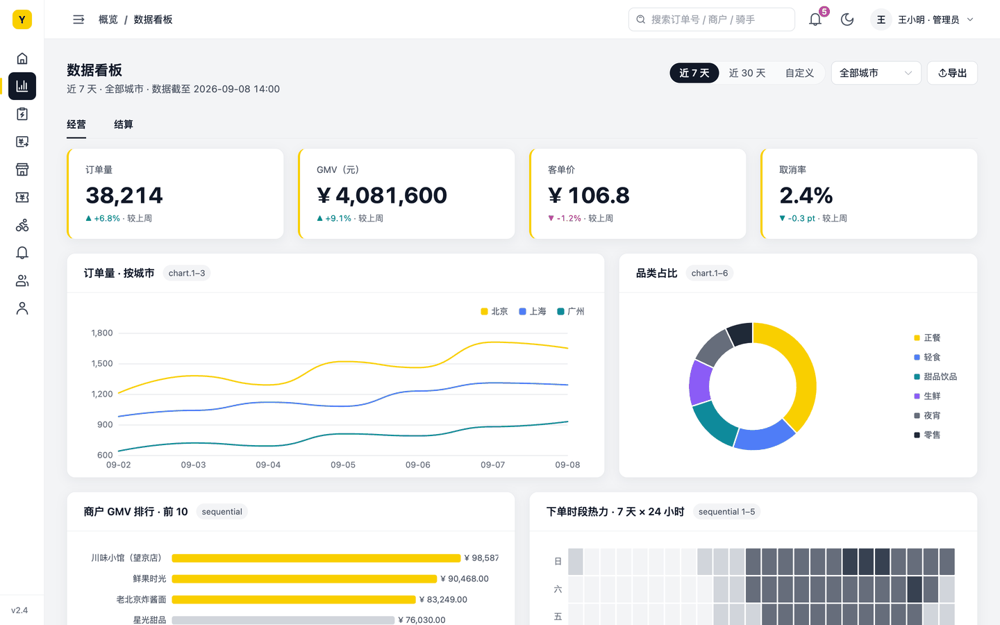
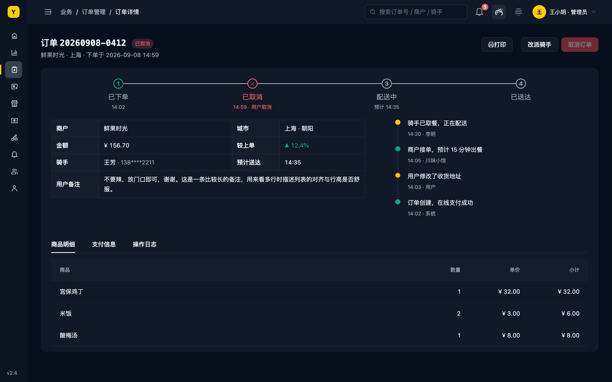
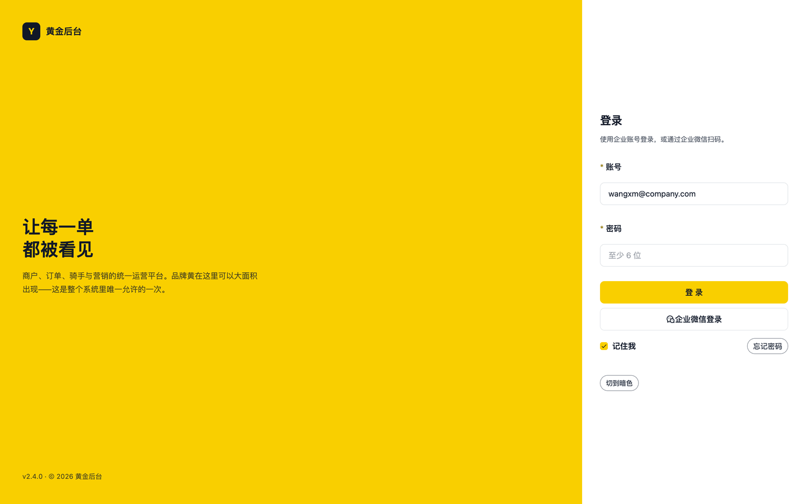
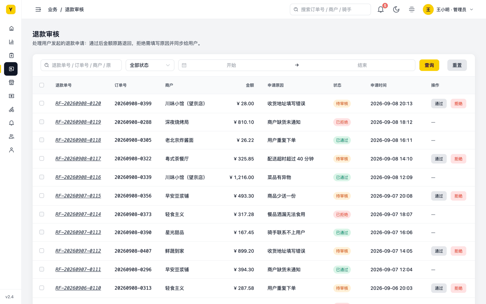

# Citrine Design System

**黄晶 · 公司级中后台设计系统** — 一个以品牌黄为唯一焦点、冷灰为骨架的 Web 中后台设计系统：DTCG 令牌单一来源、亮 / 暗两种模式、Element Plus、shadcn/ui 与 ECharts 三条桥接、给编码 Agent 的组件配方，以及一套可复跑的验收基线。


版本 **2.1.2** · Core 314 个 token · dark 70 条 delta · 变更见 [CHANGELOG](seeds/brand-yellow-e/CHANGELOG.md)

---

## 它解决什么

中后台项目的样式失控通常不是缺规范，而是规范活在文档里、代码里各写各的。Citrine 把"设计决定"收进一个可构建、可校验、可守卫的令牌系统，让人和 AI 编码 Agent 都只从同一个地方取值：

- **一个来源**：颜色、字体、字号阶梯、控件高度、间距、圆角、线宽、阴影、动效、层级、图表色全部是 DTCG 格式的 token，构建成 CSS 变量；页面不写任何色值与像素字面量。
- **暗色零重复**：`dark` 只覆写颜色与浮层层，尺寸、字体、间距一律不动；品牌黄一个字节不动。密度只有舒适一档，不做全局密度开关。
- **组件库不再"自带主见"**：Element Plus 桥接把 `--el-*` 全部指向 token，并按 Element 2.14 **全部组件**走查逐条接管它写死的主色、焦点环、色表和高度——hover 与 focus 不会再冒出一个黄色，按钮与输入框第一次真正同高。
- **给 Agent 的配方，而不是给人的论文**：`DESIGN.md` 顶部十条速查 + 一张"组件 → token"配方表；一个从未看过项目源码的编码 Agent 只凭它做出的页面，通过了全部自动验收。
- **验收基线是规范的一部分**：对比度阈值与已批准例外、可访问名称、命中区、溢出、键盘焦点、窄屏、构建一致性、全组件走查——每次改动都以此复跑。

## 设计立场（十条硬规则）

1. 黄只做主操作面：主按钮、进度 / 滑杆填充、勾选 / 开关选中、当前步骤。**选中、当前、强调一律用深黑反转块或近黑文字**，不用黄。
2. 黄底深字、白底无黄字、任何 hover / focus 不出现黄；品牌黄没有延伸色——不做浅调、深金、半透明洗色。
3. 中性色是冷灰（gray 族），暗色深底与它同族；黄与深蓝近黑形成互补，黄更跳、灰不脏。
4. 状态色只做"文字 + 同色浅底"胶囊；实底按钮只有主（黄）与危险（红底白字）。
5. 彩色文字不落在灰底上：状态色、危险色只与白底或同色浅底成对。
6. 按钮不能裸放：描边（次要）或浅底（quiet）。表格操作列是 small quiet 文字按钮，危险动作红字 + 浅红底。
7. 链接无色系（品牌决定），分四层：内容型（下划线 + 斜体）、操作型（同色胶囊描边、500 字重）、导览型（文字 + 右箭头）、标题型（近黑 + 500）。
8. 尺寸只从 token 拿：控件高度三档共用、间距 4px 阶梯、圆角按容器层级递减、字号八档、中文不低于 12px。
9. 字重：正文与胶囊 400，标签 500，反转块选中 500，数据大字 700；不要 `-webkit-font-smoothing: antialiased`。
10. 焦点必须一眼可见（近黑实线，暗色近白）；图标类控件必须有可访问名称且命中区 ≥ 24px。

## 仓库结构

```text
citrine/
├── seeds/brand-yellow-e/        # 设计系统种子（复制进项目即用）
│   ├── design-system/           #   DESIGN.md（速查 + 规则 + 配方 + 验收基线）、tokens/、themes/dark/、theme-map.json
│   ├── bridge/                  #   element-plus.css · shadcn-globals.css · echarts.js · iconpark.css / iconpark.config.ts
│   ├── README.md                #   用法、硬规则、从旧规范迁移的角色对照
│   └── CHANGELOG.md             #   rc.1 → 1.1.3 每一条决定的来历
├── previews/yellow-admin/       # 静态预览：手写 token（E）与构建产物（S）逐像素一致的两套页面
├── testbed/golden-admin/        # 实测项目一「黄金后台」：Vue 3 + Element Plus，17 个页面 × 亮 / 暗 + 全组件走查页
│   ├── PRD.md · FINDINGS.md     #   需求与 56 条实测发现（每条对应一次系统级修正）
│   └── app/                     #   AGENTS.md 是编码 Agent 的规则入口
├── testbed/legacy-shop/         # 实测项目二：暖灰旧规范的遗留后台，排练 audit → migrate → guard 的迁移路径
└── docs/screenshots/            # 本页截图
```

治理工具（`audit / migrate / guard / status / build-tokens / validate-system`）来自独立仓库 [WYCM9527/skills](https://github.com/WYCM9527/skills) 的 `design-system-steward`。本目录的脚本与文档默认它被克隆在仓库根的 `skills/` 目录。

## 快速开始

```bash
git clone https://github.com/WYCM9527/Design-System.git && cd Design-System
git clone https://github.com/WYCM9527/skills.git skills          # 治理工具，放在仓库根目录

# 把种子放进你的项目
cp -R citrine/seeds/brand-yellow-e/design-system /path/to/project/
cd /path/to/project && npm i -D style-dictionary@5.5.2
node <Design-System>/skills/design-system-steward/scripts/build-tokens.mjs --project "$PWD"   # → design-system/dist/
node <Design-System>/skills/design-system-steward/scripts/guard.mjs --project "$PWD"          # 应为 current
```

样式入口按顺序引入：组件库基础样式 → `design-system/dist/index.css` → 对应桥接（`bridge/element-plus.css` 或把 `shadcn-globals.css` 并进 `globals.css`）。暗色在 `<html>` 上加 `dark`。项目规则写进 `AGENTS.md`（见 `testbed/golden-admin/app/AGENTS.md`）。

已有旧规范的项目：先 `audit` 看只读报告，`migrate --phase adopt / replace` 自动处理无歧义项，其余按种子 README「从旧规范迁移」的**角色对照**手工映射，最后 `settle → guard / status` 两绿。排练记录见 `testbed/legacy-shop/README.md`。

## 实测项目

| 「黄金后台」订单管理 · 亮色 | 订单管理 · 暗色 |
| --- | --- |
|  |  |

| 数据看板 | 订单详情 · 暗色 |
| --- | --- |
|  |  |

| 登录页（大面积品牌黄唯一允许出现的地方） | 退款审核（盲测产物：Agent 只凭文档完成） |
| --- | --- |
|  |  |

**全组件走查页**（`#/kitchen`）把 Element Plus 全部组件的静息 / 选中 / 禁用 / 出错状态铺在一页，浮层与弹层逐个点开，三模式下对 600+ 个交互元素强制 `:hover` / `:focus-visible`，只报三类硬问题：状态切换新引入的黄色、悬停后对比掉档、不来自 token 的颜色。

| 亮色 | 暗色 |
| --- | --- |
|  |  |

**遗留项目迁移**：一个暖灰旧规范的静态后台，复制种子后按角色对照改写，`status` 从 21% 到 100%、`guard` current——和新项目是同一套样子。


## 验收基线

每次改 token 或桥接都复跑（详见 `DESIGN.md`「验收基线」；工具在 `testbed/golden-admin/tools/`，`npm run accept` 一键执行，只需 Node ≥ 22 与 Chrome）：

- 对比度：正文 ≥ 4.5:1，大字与图标 ≥ 3:1，连底色一起算；已批准的品牌例外逐条列出（三对状态色、危险按钮白字、占位符），扫描单列统计而不算失败。
- 可访问名称、无重复 id、图标控件命中区 ≥ 24px、任何模式无横向溢出与截断。
- 键盘：Tab 遍历每个可聚焦元素都有可见焦点环。
- 窄屏 1366px：侧栏默认折叠、筛选栏动作区整体换行。
- 构建一致性：`validate-system / guard / status` 三绿；预览 E 与 S 逐像素一致。
- 全组件走查：hover / focus 不新引入黄色、不掉对比、外来颜色为 0。

当前状态：105 个页面状态 × 三模式 0 未批准项；走查页三模式 0 状态问题。

## 版本策略

patch 只改描述、文档，以及让组件库遵守既有规则的桥接修正；minor 新增 token 或改 token 值（视觉会变、名字不变，条目必须写清肉眼可见的影响）；major 才改名或删除 token，并附兼容 shim。每一条规则的来历都在 [CHANGELOG](seeds/brand-yellow-e/CHANGELOG.md) 与 [FINDINGS](testbed/golden-admin/FINDINGS.md) 里可追溯。

## 已知边界

- shadcn/ui 桥接只做了变量级验证（90 个引用全部可解析），尚未在 React 项目里渲染验证。
- 只确认了桌面宽度（≥ 1280px）的布局；断点规则等真实需求出现时再作为提案加入。
- 走查页未铺 Tour、Watermark、Affix、Backtop、InfiniteScroll、TableV2 等依赖滚动或运行时的组件。

## 方法

Citrine 不是一次性画出来的：每一条规则都来自实测项目里的一次具体反馈——发现、拍板、改到 token / 桥接 / 配方层（而不是页面层）、复跑验收、写进 CHANGELOG。测试项目存在的唯一目的是打磨这套通用系统。
